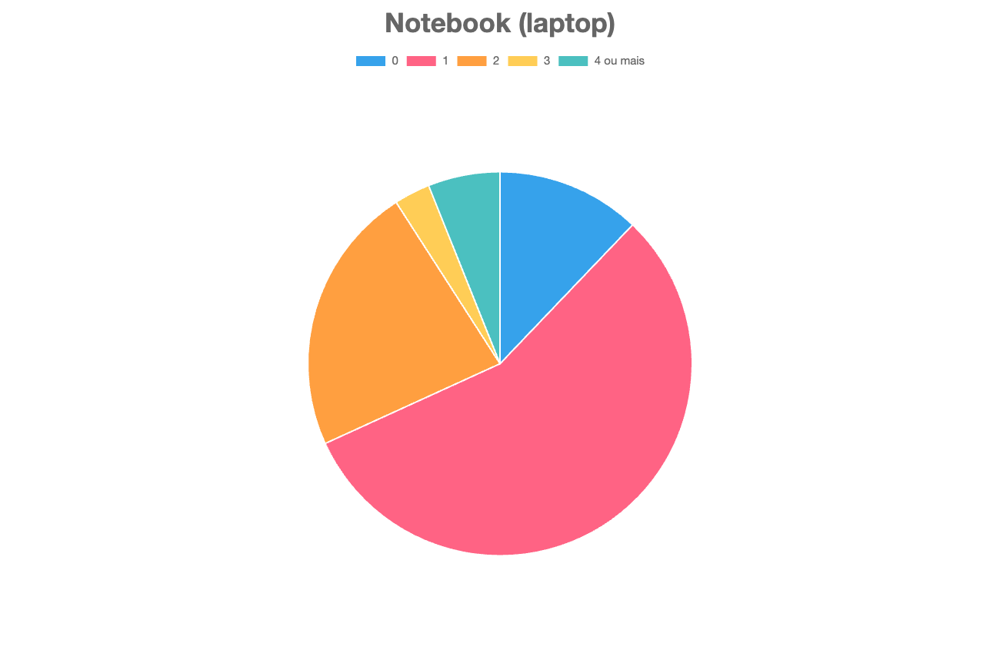

# Sobre o programa

Este software, escrito em [TypeScript](https://www.typescriptlang.org), é capaz de tratar os dados obtidos através de um formulário de perfil socioeconômico dos alunos da [FATEC](http://www.fatecsp.br) (Faculdade de Tecnologia do Estado de são Paulo), dispondo-os em gráficos de setores.

<p align="center">
  
</p>

## Execução

Para que o programa funcione corretamente em sua máquina, instale a última versão do [Deno](https://deno.com) em seu computador, abra um terminal na pasta deste script, e execute o seguinte comando:

```sh
deno run --allow-all script.ts
```

## Modificação

Caso queira fazer alterações no código, use o [Visual Studio Code](https://code.visualstudio.com) e sua respectiva [extensão para o Deno](https://marketplace.visualstudio.com/items?itemName=denoland.vscode-deno).

## Licença

Este projeto é licenciado em código aberto, segundo os termos da [MIT-0](./LICENSE.md).